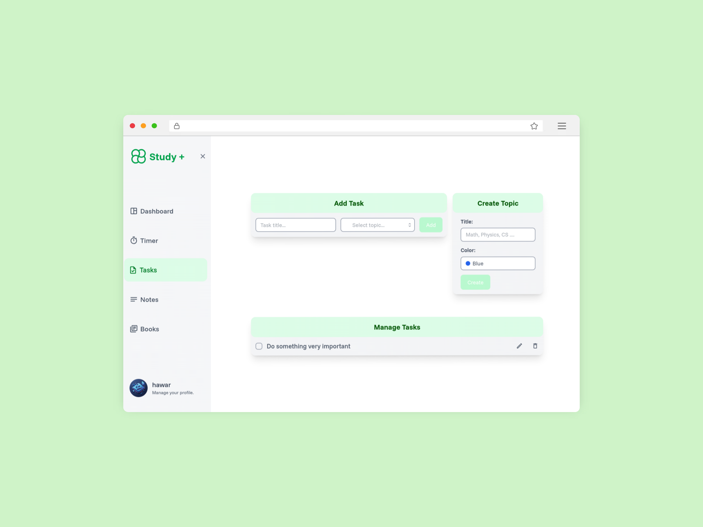
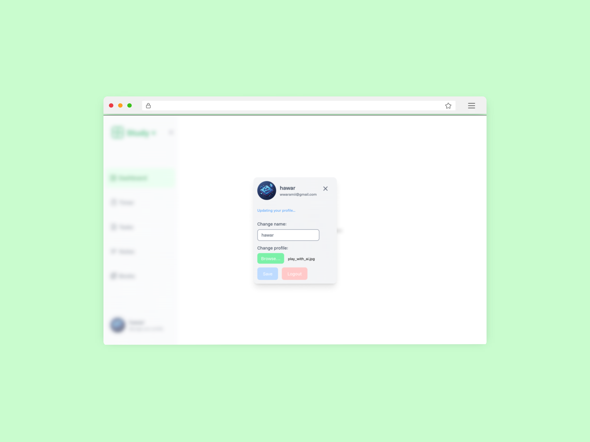
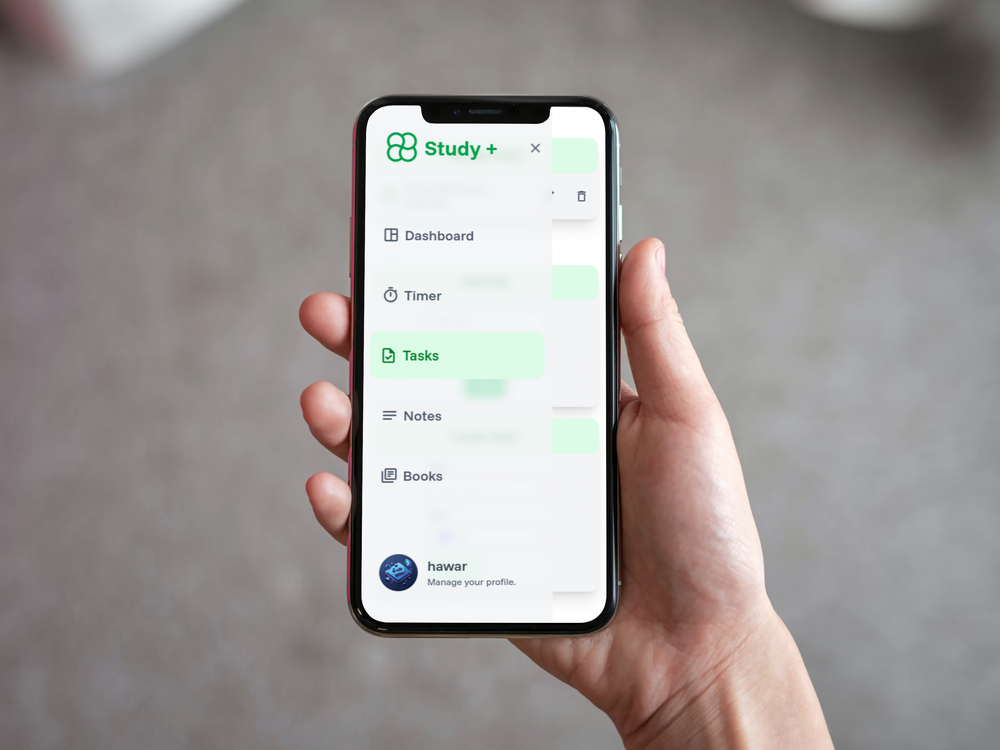
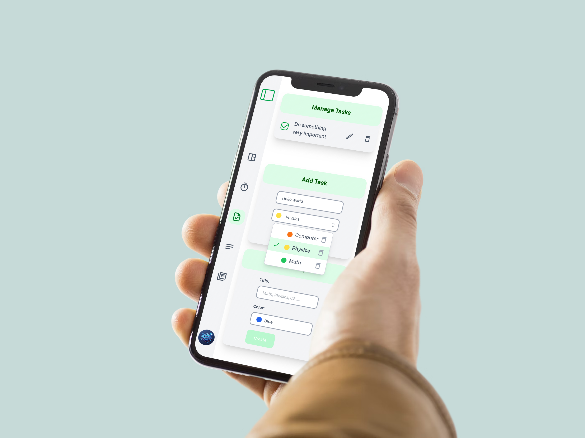

# 📗 Study Plus, A tool for easier study.

This will make your life easier with providing a dashboard for your study workflow ⏫

### 🛠 Tech Stack

- **Vite:** Fast dev server & build tool (because slow builds are not my thing).

- **React:** Built the UI the modern way, with **React Context** [_click here_](./src/context/)
  for smooth global state management.

- **Tailwind CSS:** Clean, responsive styles without wrestling with CSS.

- **Supabase:**

  - Auth via magic email links and Google OAuth.

  - Real-time data fetching. [_click here_](./src/components/TopicPopover.tsx)

  - Row Level Security (RLS) for safe data access.

  - Storage buckets for file handling.

- **Headless UI:** Accessible, unstyled components to make the UI shine. [_click here_](./src/components/CreateTopic.tsx)

- **Extras:** [Global loadings](./src/context/LoadingContext.tsx) , [global alerts](./src/context/AuthContext.tsx), and a clean, consistent design across the app.

This project is part of my journey to sharpen my skills and get job-ready.

## 📸 Screen shots

